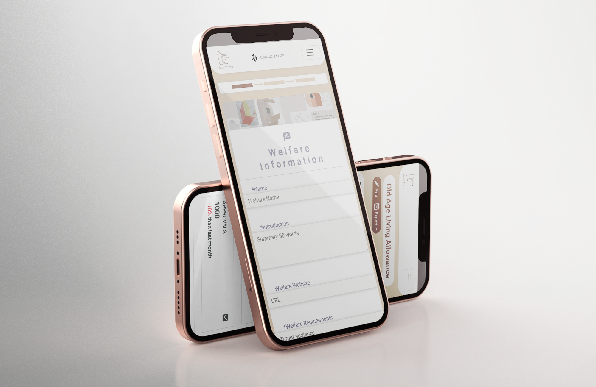
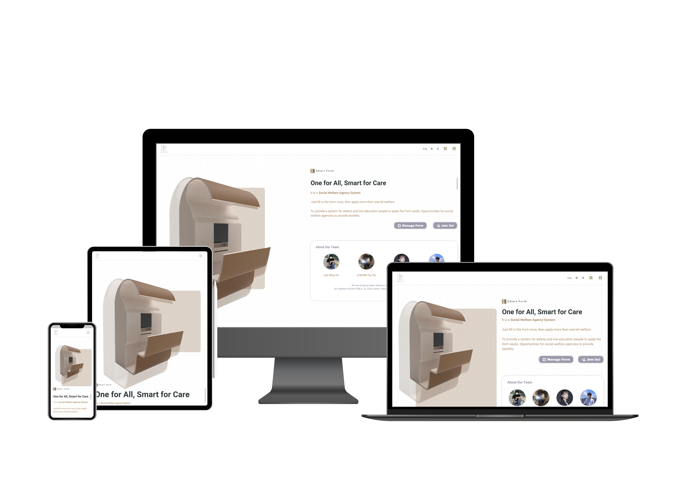
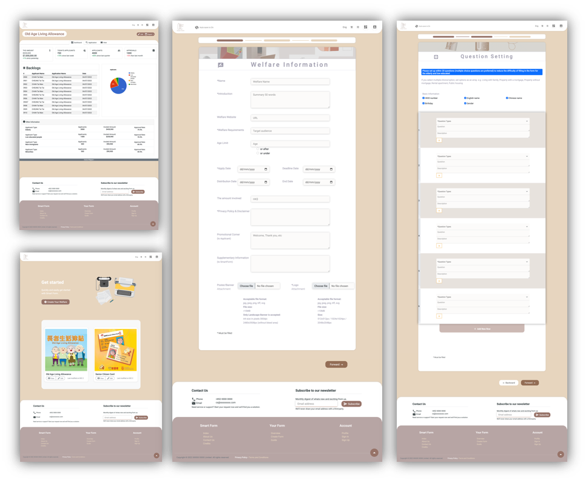
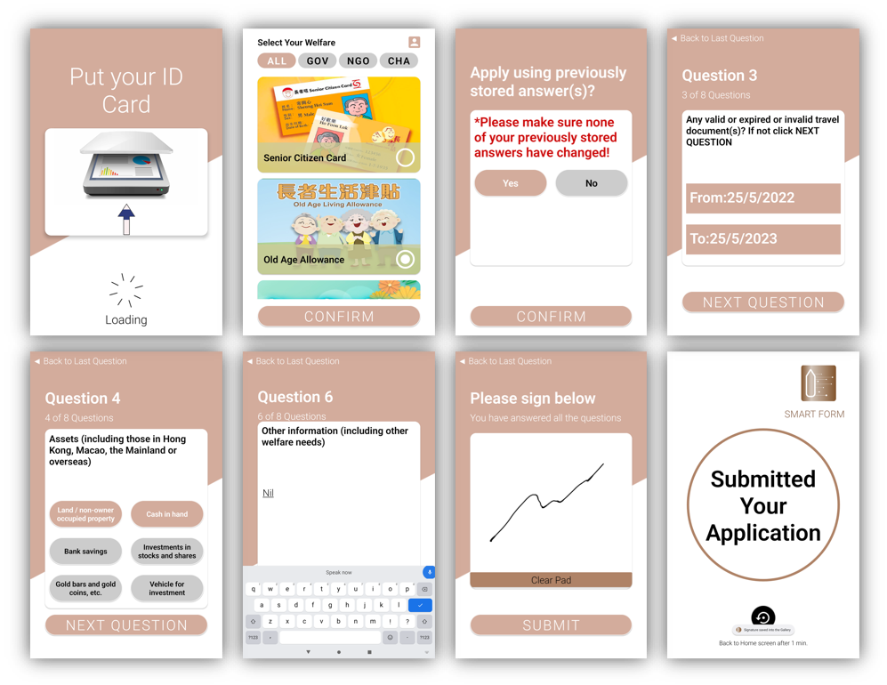

# Smart Form

Our team's project name for this competition and final year project is called "Smart Form". 

I was designed as a lead UI/UX designer and lead front-end programmer on the Final Year Project. And I have a better understanding of the CI/CD workflow of making an Android-based kiosk and a website that LWL software engineering & HKDI design students are doing since our group comes from two disciplines.

Our team developed the "Smart Form" to simplify the form-filling procedures so as to reduce the time needed and ease their pressure.

The Kiosk is an easy-to-use way to facilitate form-filling. After completing one form, users can apply for a few others intelligently at the same time.

The Website aims to support non-profit organizations and companies to promote their welfare. They can create different types of welfare for Kiosk users to apply.

Demo Video: 
https://www.youtube.com/watch?v=kBMR9jlvl2I

Complete Kiosk Android App:
https://github.com/Smart-Form/smartForm-android

Static Website (no backend connection):
https://smart-form.github.io/smartForm-website/
